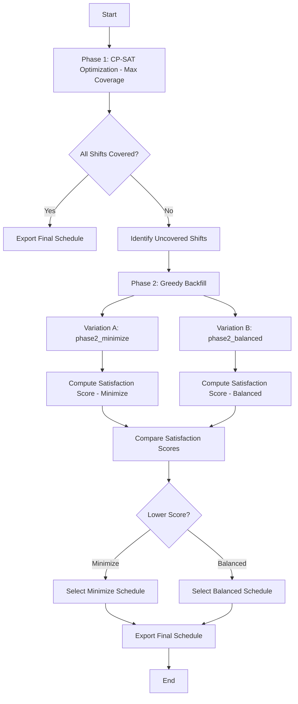

# Telemedicine Scheduling & Forecasting System

## Executive Summary

This system automates telemedicine provider scheduling across multiple hospitals and facilities by integrating time series forecasting with constraint-aware optimization. The two-phase approach combines exact optimization techniques with heuristic flexibility to produce fair, contract-compliant schedules that dynamically adapt to predicted changes in patient demand.

## Table of Contents

1. [System Overview](#system-overview)
2. [Forecasting Module](#forecasting-module)
3. [Scheduling Engine](#scheduling-engine)
4. [Integration & Workflow](#integration--workflow)
5. [Mathematical Formulation](#mathematical-formulation)
6. [Implementation Details](#implementation-details)
7. [Advantages & Limitations](#advantages--limitations)
8. [Future Enhancements](#future-enhancements)

## System Overview

Telemedicine fundamentally changes provider scheduling by enabling remote coverage across multiple facilities. This creates a complex combinatorial optimization problem where providers must be distributed across sites and time periods while satisfying numerous constraints:

- **Credentialing requirements**: Each provider is credentialed at specific facilities
- **Contract compliance**: Providers have minimum/maximum hour requirements and shift type preferences
- **Hour restrictions**: Daily and weekly hour limits prevent provider burnout
- **Operational constraints**: Consecutive shift limits and specific shift type requirements
- **Fairness objectives**: Balanced workload distribution across the provider pool

The system addresses this complexity through a two-phase approach:

1. **Phase 1 (Optimization)**: Exact Mixed Integer Programming solution using CP-SAT
2. **Phase 2 (Refinement)**: Heuristic backfill for remaining uncovered shifts

This hybrid approach ensures hard constraint compliance while maintaining computational tractability for large-scale problems.

## Forecasting Module

### Objective

The forecasting module predicts week-ahead fluctuations in patient demand at each facility to enable proactive scheduling. By anticipating demand changes, the scheduling engine can allocate provider resources more effectively, reducing uncovered shifts and improving service quality.

### Data Sources

The module integrates publicly available epidemiological data from the CDC HHS Protect dataset, which provides weekly facility-level metrics on ICU capacity utilization:

- Percent ICU beds occupied (total)
- Percent ICU beds occupied by COVID-19 patients
- Percent ICU beds occupied by influenza patients
- Percent ICU beds occupied by RSV patients
- Additional respiratory illness indicators

### Methodology

#### Step 1: Time Series Preprocessing

For each metric $m$ at facility $f$, compute the week-over-week percentage change:

$$\Delta_t^{(m)} = \frac{X_t^{(m)} - X_{t-1}^{(m)}}{X_{t-1}^{(m)}} \times 100$$

where:
- $X_t^{(m)}$ = metric $m$ value at time $t$ (in weeks)
- $\Delta_t^{(m)}$ = percentage change from $t-1$ to $t$

This differencing operation removes the baseline trend and focuses the model on short-term fluctuations.

#### Step 2: Holt-Winters Exponential Smoothing

Apply the Holt-Winters multiplicative model to the percentage change series. The model maintains three state components:

**Level component** $L_t$:
$$L_t = \alpha \cdot \Delta_t^{(m)} + (1 - \alpha) \cdot (L_{t-1} + T_{t-1})$$

**Trend component** $T_t$:
$$T_t = \beta \cdot (L_t - L_{t-1}) + (1 - \beta) \cdot T_{t-1}$$

**Seasonal component** $S_t$ (with seasonal period $s = 52$ weeks):
$$S_t = \gamma \cdot \frac{\Delta_t^{(m)}}{L_t} + (1 - \gamma) \cdot S_{t-s}$$

The smoothing parameters $\alpha$, $\beta$, and $\gamma$ are typically learned via maximum likelihood estimation:
- $\alpha \in [0, 1]$ controls level smoothing
- $\beta \in [0, 1]$ controls trend smoothing
- $\gamma \in [0, 1]$ controls seasonal smoothing

**One-week-ahead forecast** $\hat{\Delta}_{t+1}^{(m)}$:
$$\hat{\Delta}_{t+1}^{(m)} = (L_t + T_t) \cdot S_{t+1-s}$$

#### Step 3: Demand Adjustment

The predicted percentage change is applied to baseline facility volumes to generate adjusted demand forecasts:

$$V_{t+1}^{\text{adj}} = V_{t+1}^{\text{baseline}} \times \left(1 + \frac{\hat{\Delta}_{t+1}^{(m)}}{100}\right)$$

where:
- $V_{t+1}^{\text{adj}}$ = adjusted consult volume for facility at $t+1$
- $V_{t+1}^{\text{baseline}}$ = baseline consult volume (historical average)
- $\hat{\Delta}_{t+1}^{(m)}$ = predicted percentage change

This adjusted volume feeds directly into the scheduling engine's capacity constraints.

### Advantages

- **Interpretability**: Each component (level, trend, seasonality) has direct operational meaning
- **Computational efficiency**: Exponential smoothing is $O(n)$ with minimal memory overhead
- **Baseline performance**: Serves as a strong benchmark for more complex forecasting approaches
- **Real-time adaptability**: Easily updates with new weekly data

### Limitations

- **Myopic horizon**: Forecasts only one week ahead, limiting strategic planning
- **Independence assumption**: Models each metric independently without capturing correlations
- **Exogenous blindness**: Does not incorporate external drivers such as holidays, policy changes, or community health events
- **Structural breaks**: May not adapt well to regime changes in patient volume patterns
- **Aggregation loss**: Does not model facility-level or provider-specific demand heterogeneity

## Scheduling Engine

### Objective

The scheduling engine assigns providers to shifts across multiple facilities while enforcing hard (P1) and soft (P2) constraints. Hard constraints are non-negotiable compliance requirements (credentialing, hour limits), while soft constraints represent preferences (fairness, workload balance).

### Input Data Specifications

#### Facility Coverage (`Facility_Coverage.xlsx`)

Specifies the required number of providers per shift type at each facility:

| Facility | Date | Shift Type | Required Coverage |
|----------|------|-----------|------------------|
| Hospital A | 2025-01-01 | AM | 2 |
| Hospital A | 2025-01-01 | PM | 1 |

#### Provider Contract (`Provider_Contract.xlsx`)

Defines provider employment terms and shift requirements:

| Provider ID | Employment Type | Min Shifts | Max Shifts | Min PM Shifts | Weekend Required |
|------------|-----------------|-----------|-----------|--------------|-----------------|
| P001 | Full-Time | 40 | 50 | 10 | Yes |
| P002 | Independent Contractor | 10 | 15 | 3 | No |

#### Provider Credentialing (`Provider_Credentialing.xlsx`)

Maps providers to facilities where they are credentialed to practice:

| Provider ID | Facility |
|------------|----------|
| P001 | Hospital A |
| P001 | Hospital B |
| P002 | Hospital A |

#### Provider Availability (`Provider_Availability.xlsx`)

Specifies which shifts each provider can work (medical leave, conflicts, etc.):

| Provider ID | Date | Shift Type | Available |
|------------|------|-----------|-----------|
| P001 | 2025-01-01 | AM | True |
| P001 | 2025-01-01 | PM | False |

#### Facility Volume (`Facility_Volume.xlsx`)

Expected consult volumes (post-forecast adjustment) for resource planning:

| Facility | Date | Shift Type | Expected Volume |
|----------|------|-----------|-----------------|
| Hospital A | 2025-01-01 | AM | 15 |
| Hospital A | 2025-01-01 | PM | 8 |

### Two-Phase Scheduling Approach

#### Phase 1: CP-SAT Optimization (Exact Solution)

The first phase formulates scheduling as a Mixed Integer Programming (MIP) problem and solves it using Google OR-Tools' CP-SAT solver, which combines constraint propagation with SAT-based techniques.

**Decision Variables:**

$$x_{p,f,d,s} \in \{0, 1\}$$

where $x_{p,f,d,s} = 1$ if provider $p$ is assigned to facility $f$ on day $d$ for shift $s$, and $0$ otherwise.

**Coverage Variables:**

$$c_{f,d,s} = \sum_{p=1}^{P} x_{p,f,d,s}$$

The number of providers assigned to each shift (subject to meeting facility requirements).

**Hour Accumulation:**

$$h_{p,d} = \sum_{f,s} x_{p,f,d,s} \times \text{shift\_hours}_{s}$$

Total hours worked by provider $p$ on day $d$.

**Weekly Hours:**

$$H_{p,w} = \sum_{d \in \text{week } w} h_{p,d}$$

Total hours worked by provider $p$ in week $w$.

**Objective Function:**

Maximize total coverage across all shifts while enforcing constraints:

$$\text{maximize} \sum_{f,d,s} c_{f,d,s}$$

This ensures the maximum number of facility shift requirements are met.

**Constraints (Hard):**

1. **Credentialing Compliance**: Provider can only work at credentialed facilities
$$x_{p,f,d,s} \leq \mathbb{1}[\text{provider } p \text{ credentialed at facility } f]$$

2. **Coverage Requirements**: Each facility-shift must meet or exceed required coverage
$$c_{f,d,s} \geq \text{required\_coverage}_{f,d,s}$$

3. **Availability**: Providers can only work when available
$$x_{p,f,d,s} \leq \mathbb{1}[\text{provider } p \text{ available on day } d \text{ for shift } s]$$

4. **Daily Hour Limits**: Providers cannot exceed daily maximums (typically 12 hours)
$$h_{p,d} \leq H_{\text{max,daily}} \quad \forall p, d$$

5. **Weekly Hour Limits**: Enforce contract-specific weekly limits
$$H_{p,w} \leq H_{p}^{\text{max}} \quad \forall p, w$$

where $H_{p}^{\text{max}}$ is provider $p$'s contractually agreed maximum weekly hours.

6. **Consecutive Shift Restriction**: Providers cannot work more than 5 consecutive days
$$\sum_{d=i}^{i+5} \sum_{f,s} x_{p,f,d,s} \leq 5 \quad \forall p, i$$

This prevents provider fatigue and maintains service quality.

7. **Minimum Contract Hours**: Full-time providers must meet minimum hour requirements
$$H_{p,w} \geq H_{p}^{\text{min}} \quad \forall p \in \text{FullTime}$$

**Solver Configuration:**

The CP-SAT solver employs:
- Constraint propagation for bound tightening
- SAT-based search with heuristic variable ordering
- Parallel optimization with multiple worker threads
- Early termination when solution gap falls below tolerance (typically 1%)

**Output:**

Phase 1 produces a baseline schedule $X^*$ that maximizes coverage while satisfying all hard constraints. If all shifts are covered, the algorithm proceeds directly to the final export. Otherwise, Phase 2 identifies uncovered shifts and applies heuristic backfilling.

#### Phase 2: Greedy Backfill (Heuristic Refinement)

For shifts remaining uncovered after Phase 1, the system applies a greedy heuristic to assign eligible providers. Two variations are generated to explore the efficiency-fairness tradeoff:

**Variation A: Minimize Consolidation** (`phase2_minimize`)

Assigns uncovered shifts to the minimum number of providers, concentrating workload. This variation prioritizes operational simplicity and schedule compactness:

1. Sort uncovered shifts by facility and day
2. For each uncovered shift $(f, d, s)$:
   - Identify eligible providers using `is_eligible_greedy()`
   - Select the provider with the lowest current hour count
   - Assign the shift to that provider
   - Update provider hour totals

**Variation B: Balanced Consolidation** (`phase2_balanced`)

Distributes uncovered shifts evenly across eligible providers, promoting fairness and workload balance:

1. Sort uncovered shifts by facility and day
2. For each uncovered shift $(f, d, s)$:
   - Identify eligible providers using `is_eligible_greedy()`
   - Select the provider with the lowest current hour count
   - If multiple providers have equal hours, select randomly
   - Assign the shift to that provider
   - Update provider hour totals

**Eligibility Checking** (`is_eligible_greedy()`):

For a provider $p$ to be eligible for assignment to shift $(f, d, s)$, the following conditions must hold:

$$\text{eligible}(p, f, d, s) \iff$$

1. **Credentialing**: $\text{credentialed}(p, f)$
2. **Availability**: $\text{available}(p, d, s)$
3. **Daily Hours**: $h_{p,d} + \text{shift\_hours}_s \leq H_{\text{max,daily}}$
4. **Weekly Hours**: $H_{p,w} + \text{shift\_hours}_s \leq H_{p}^{\text{max}}$
5. **Consecutive Days**: Adding this shift does not exceed consecutive shift limit
6. **Contract Type**: If minimum hours required, $H_{p,w} + \text{shift\_hours}_s \geq H_{p}^{\text{min}}$ by week end

### Satisfaction Score

The satisfaction score quantifies compliance with provider contracts and fairness objectives, enabling systematic comparison of different schedule variations:

$$\text{Score} = w_1 \cdot \text{Overage}_{\text{total}} + w_2 \cdot \text{Overage}_{\text{PM}} + w_3 \cdot \text{Overage}_{\text{weekend}}$$

where:

**Total Hour Overage**:
$$\text{Overage}_{\text{total}} = \sum_{p} \max\left(0, H_{p,w} - H_{p}^{\text{max}}\right)$$

Penalizes providers exceeding their contracted maximum hours.

**PM Shift Overage**:
$$\text{Overage}_{\text{PM}} = \sum_{p \in \text{FT}} \max\left(0, \text{PM\_shifts}_{p,w} - \text{PM\_max}_{p}\right)$$

Penalizes full-time providers exceeding PM shift commitments, prioritizing workload balance across shift types.

**Weekend Overage**:
$$\text{Overage}_{\text{weekend}} = \sum_{p} \max\left(0, \text{Weekend\_shifts}_{p,w} - \text{Weekend\_max}_{p}\right)$$

Penalizes providers exceeding weekend shift commitments, respecting work-life balance.

**Weights** $w_1, w_2, w_3$ are tunable parameters (default: $w_1 = 1, w_2 = 1.5, w_3 = 2.0$) that reflect organizational priorities. Higher weights emphasize certain constraints; for example, increasing $w_3$ prioritizes fair weekend distribution.

The final schedule selects the variation with the lower satisfaction score:

$$\text{Selected Schedule} = \arg\min_{\text{var} \in \{\text{minimize}, \text{balanced}\}} \text{Score}_{\text{var}}$$

## Integration & Workflow

### System Workflow

### Data Flow

The system operates on a weekly cycle:

1. **Input Stage**: Ingest provider and facility data from Excel files
2. **Forecast Stage**: Retrieve CDC data, fit models, and predict demand changes
3. **Adjustment Stage**: Scale baseline volumes by forecast adjustments
4. **Optimization Stage**: Solve Phase 1 MIP to maximize coverage
5. **Refinement Stage**: Apply Phase 2 backfill if uncovered shifts remain
6. **Selection Stage**: Compare satisfaction scores and select best variant
7. **Export Stage**: Output final schedule and performance metrics

## Mathematical Formulation

### Formal Problem Statement

**Given:**
- Set of providers $P = \{1, 2, \ldots, |P|\}$
- Set of facilities $F = \{1, 2, \ldots, |F|\}$
- Set of days $D = \{1, 2, \ldots, 7\}$ (weekly planning horizon)
- Set of shifts $S = \{\text{AM, PM, Night}\}$
- Credentialing matrix $\mathcal{C} \in \{0,1\}^{|P| \times |F|}$ where $\mathcal{C}_{pf} = 1$ if provider $p$ is credentialed at facility $f$

**Find:**
- Assignment matrix $X \in \{0,1\}^{|P| \times |F| \times |D| \times |S|}$ that maximizes coverage subject to constraints

**Maximize:**
$$\text{Coverage} = \sum_{p \in P} \sum_{f \in F} \sum_{d \in D} \sum_{s \in S} x_{p,f,d,s}$$

**Subject to:**
1. Credentialing constraints
2. Hour balance constraints (daily and weekly)
3. Availability constraints
4. Contract compliance constraints
5. Fairness constraints (via satisfaction score post-hoc)

## Implementation Details

### Technology Stack

- **Optimization Solver**: Google OR-Tools CP-SAT
- **Time Series Forecasting**: Statsmodels Holt-Winters implementation
- **Data Processing**: Pandas DataFrames
- **Input/Output**: Excel files (openpyxl backend)

### Algorithm Complexity

**Phase 1 (CP-SAT):**
- Problem size: $O(|P| \times |F| \times |D| \times |S|)$ variables
- Constraint count: $O((|P| \times |F| \times |D| \times |S|) + |F| \times |D| \times |S|)$
- Typical runtime: 30-300 seconds (depends on instance size and optimality gap)
- Scalability: Handles 100+ providers and 10+ facilities efficiently

**Phase 2 (Greedy Backfill):**
- Time complexity: $O(U \times |P|)$ where $U$ is the number of uncovered shifts
- Space complexity: $O(|P| + |F| \times |D| \times |S|)$
- Typical runtime: <1 second

**Forecasting Module:**
- Time series fitting: $O(n)$ where $n$ is historical data points
- Prediction: $O(1)$
- Typical runtime: <100ms per metric

### Configuration Parameters

The system accepts several tunable parameters:

| Parameter | Default | Description |
|-----------|---------|-------------|
| `alpha` (Holt-Winters level smoothing) | 0.2 | Responsiveness to recent observations |
| `beta` (trend smoothing) | 0.1 | Trend component smoothing |
| `gamma` (seasonal smoothing) | 0.05 | Seasonal pattern smoothing |
| `consecutive_day_limit` | 5 | Maximum consecutive working days |
| `daily_hour_limit` | 12 | Maximum hours per day |
| `satisfaction_weight_total` | 1.0 | Weight for total hour overage |
| `satisfaction_weight_pm` | 1.5 | Weight for PM shift overage |
| `satisfaction_weight_weekend` | 2.0 | Weight for weekend overage |

## Advantages & Limitations

### Advantages

- **Exact Optimization**: Phase 1 guarantees optimal coverage subject to hard constraints
- **Constraint Flexibility**: Easily accommodates new constraint types and facility-specific rules
- **Fairness Integration**: Satisfaction score enables systematic fairness optimization
- **Demand-Driven**: Forecast module enables proactive, anticipatory scheduling
- **Scalability**: Handles large provider pools and multi-facility networks
- **Traceability**: Clear audit trail of assignments and constraint compliance

### Limitations

- **Myopic Forecasting**: One-week horizon limits strategic planning capabilities
- **Independent Metrics**: Forecasting models treat health metrics independently without capturing correlations (e.g., COVID and respiratory illness co-movement)
- **Exogenous Variables**: Does not incorporate holidays, policy changes, or community events that drive demand
- **Greedy Heuristic**: Phase 2 backfill is not globally optimal; may produce suboptimal assignments for uncovered shifts
- **Facility Interdependencies**: Does not model network effects or cross-facility provider sharing dynamics
- **Static Contracts**: Assumes provider contracts remain fixed; does not adapt to mid-week availability changes

## Future Enhancements

### Near-Term (1-3 months)

1. **Multi-Step Forecasting**: Extend horizon to 2-4 weeks using VAR models
2. **External Regressors**: Incorporate holiday calendars, policy announcements, and weather data
3. **Facility Clustering**: Group similar facilities to improve forecast signal
4. **Real-Time Updates**: Integrate with telemedicine platform APIs for live availability updates

### Medium-Term (3-6 months)

1. **Machine Learning Models**: Train gradient boosting and neural network forecasters on historical data
2. **Causal Inference**: Identify exogenous factors driving demand via Granger causality and dynamic causal modeling
3. **Hierarchical Forecasting**: Reconcile multi-level forecasts (facility → region → national) for consistency
4. **Satisfaction Function Learning**: Use historical schedule data to learn provider preference functions

### Long-Term (6+ months)

1. **Reinforcement Learning**: Develop learning-based backfill heuristics that improve over multiple scheduling cycles
2. **Robust Optimization**: Optimize schedules under demand uncertainty using distributionally robust techniques
3. **Dynamic Pricing**: Implement surge pricing for high-demand periods to incentivize provider participation
4. **Predictive Churn Modeling**: Forecast provider turnover and proactively adjust capacity planning
5. **Dashboard Integration**: Real-time monitoring of schedule performance, forecast accuracy, and fairness metrics

### Research Directions

- Comparison with industry benchmarks (e.g., commercial scheduling software)
- User studies on provider satisfaction with algorithmically-generated schedules
- Simulation of different forecasting and backfill strategies under varying demand scenarios
- Cost-benefit analysis of fairness improvements versus operational efficiency